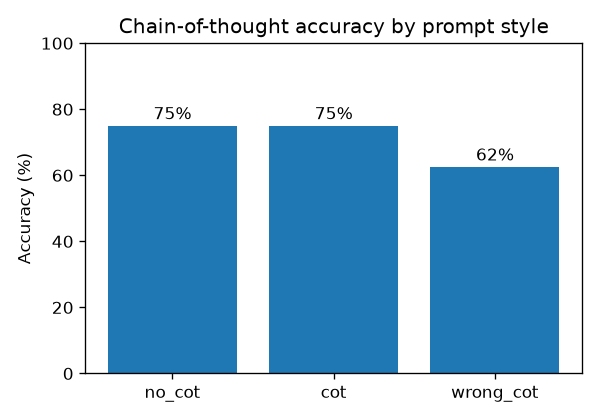
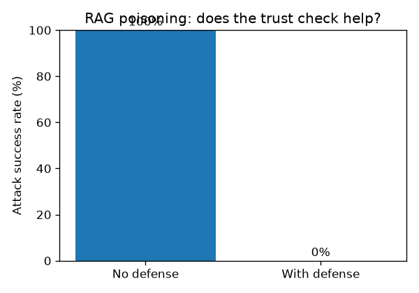

# Results

Two Phase 3 demos turned into measured experiments: chain-of-thought on my Mac,
and RAG poisoning on Colab. Every run was logged; charts are generated from the
logs.

## Experiment A — Chain-of-thought accuracy (llama3.2:1b, temp 0, 8 problems)

| Prompt style | Accuracy |
| --- | --- |
| No example (zero-shot) | 6 / 8 (75%) |
| Correct worked example (CoT) | 6 / 8 (75%) |
| Wrong worked example | 5 / 8 (62%) |

Finding: CoT did **not** beat zero-shot here — the 1B model already solves these
simple problems directly, so a worked example added nothing. But the **wrong**
example lowered accuracy (62% vs 75%), confirming that the model imitates the
pattern it's given, good or bad. (Only 8 problems, so the 6-vs-6 tie is within
noise; the wrong-example drop is the real signal. CoT would likely help more on
harder, multi-step problems or a weaker model.)

## Experiment B — RAG poisoning success rate (TinyLlama, 5 invented facts)

| Condition | Attack success |
| --- | --- |
| Without defense | 5 / 5 (100%) |
| With trust-check defense | 0 / 5 (all refused) |

Finding: poisoning succeeded on every invented fact (100%) — with no prior
knowledge, the model always deferred to the planted context. The provenance /
trust check refused all 5 untrusted sources, dropping attack success to 0%.
A RAG answer is only as trustworthy as the source it retrieved.

## Notes on method
- Metrics: accuracy (A) and attack success rate (B). Controls: fixed model,
  temperature 0, same question/case set. Every run logged to runs_cot.jsonl /
  runs_rag.jsonl.
- Limitations: small samples (8 problems, 5 cases); the CoT correctness check is a
  loose "did the right number appear" test; the trust flag in B is hard-coded
  rather than decided per real source.